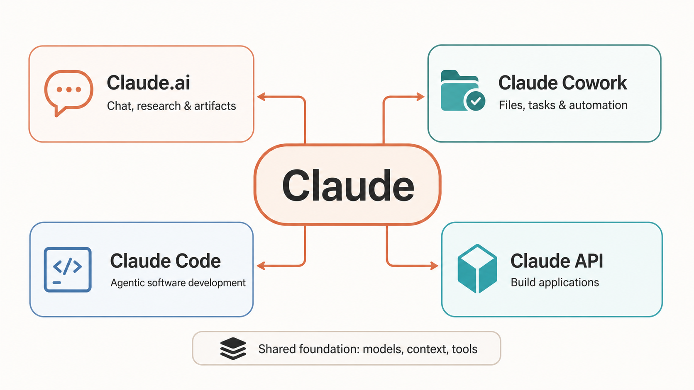

# Claude Fundamentals

## About

Claude is Anthropic’s family of AI models and products for working with language, reasoning, analysis, code, and visual inputs. It is useful to think of Claude not as one chat application, but as a shared intelligence layer delivered through different interfaces for different kinds of work.

For example, the same underlying capabilities can help you research a topic, build a software feature, automate a file-based task, or power an application through an API. Choosing the right interface is often more important than writing a longer prompt.

<figure><figcaption></figcaption></figure>

_The Claude ecosystem: select the interface that best matches the work, while treating models, context, and tools as the shared foundation._

## The Claude Ecosystem

| Interface         | Best for                                                     | Typical outcome                                            |
| ----------------- | ------------------------------------------------------------ | ---------------------------------------------------------- |
| **Claude.ai**     | Conversation, analysis, research, writing, and artifacts     | A decision, explanation, draft, or interactive deliverable |
| **Claude Cowork** | File-based work, repeatable tasks, and supervised automation | A completed task across local or connected workspaces      |
| **Claude Code**   | Exploring, changing, testing, and reviewing software         | A verified change in a codebase                            |
| **Claude API**    | Building Claude into products and engineering workflows      | A reliable AI capability inside an application             |

The boundaries are practical rather than absolute. A research task begun in Claude.ai may become a product feature built through the API. A design explored in an artifact may be implemented and verified in Claude Code. This guide explains how those experiences connect.

## What Claude Is Good At

Claude is especially effective when the task involves understanding and transforming unstructured or semi-structured information:

* **Language and reasoning:** explaining concepts, synthesizing evidence, planning work, and comparing options.
* **Code:** reading repositories, proposing changes, debugging, generating tests, and reviewing implementations.
* **Vision:** analysing images, screenshots, diagrams, and documents supplied as input.
* **Structured work:** extracting information, following rules, producing defined formats, and using tools when the environment provides them.


Claude is not a substitute for domain judgment, source verification, or testing. Treat its output as an informed collaborator’s work: high-leverage, but still subject to review.


## The Core Mental Model

A useful model for working with Claude is:

```
Outcome quality = model capability × context quality × task clarity × verification
```

A stronger model can help with difficult reasoning, but it cannot recover information it was never given. Similarly, a perfect prompt is not enough if the task has vague success criteria or the result is never checked.

This is why the rest of this guide gives equal weight to:

1. **Models** — choosing an appropriate capability level for the work.
2. **Context** — supplying the right information without drowning the task in noise.
3. **Tools and interfaces** — giving Claude the right way to act on the task.
4. **Verification** — checking claims, tests, outputs, and side effects before trusting a result.

## A Practical Starting Path

Start with the smallest surface that fits your goal:

1. Use **Claude.ai** to learn, analyse, write, and explore.
2. Learn **context engineering** when tasks require reliable, repeatable output.
3. Use **Claude Code** when the work lives in a software repository and needs implementation plus verification.
4. Use the **Claude API** when you need to build the capability into a product or workflow.
5. Use **agent engineering** when the task requires tools, state, evaluation, and human supervision—not merely a long prompt.

## What This Section Covers

The pages below move from foundations to hands-on application:

* **Claude Models** and **Model Selection** explain capability, speed, cost, and trade-offs.
* **Plans, Usage & Limits** and **Extended Thinking** explain operational constraints and deliberate reasoning.
* **Claude Ecosystem** helps you choose between Claude.ai, Cowork, Code, and the API.
* The following chapters then cover day-to-day work, context, coding agents, APIs, and production agents.

## Further Reading

* [Anthropic: Intro to Claude](https://docs.anthropic.com/en/docs/welcome)
* [Claude Code: Getting Started](https://docs.anthropic.com/en/docs/claude-code/getting-started)
* [Model Context Protocol](https://docs.anthropic.com/en/docs/mcp)
