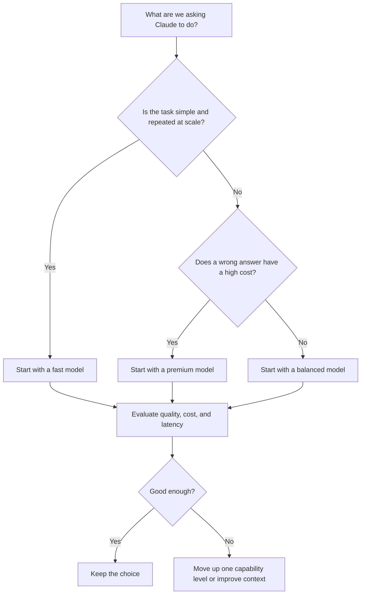

# Model Selection

Choosing a Claude model is a trade-off, not a guessing game. We choose based on the task, the cost of a wrong answer, how quickly we need the result, and how much work the model must do.

The goal is not to use the biggest model every time. The goal is to use the smallest model that reliably gives us a good result.

## A Simple Decision Path


Before moving to a more capable model, check whether the real problem is missing context, an unclear task, or no verification step. A better model cannot fix a vague definition of “done.”


## The Four Questions We Ask

### 1. How hard is the task?

Use a more capable model when the work needs deep reasoning, broad code understanding, careful planning, or many connected decisions.

Examples:

* tracing a production problem across services;
* redesigning a component without breaking existing behaviour;
* analysing a long technical document with conflicting requirements;
* coordinating a multi-step agent workflow.

For short summaries, extraction, tagging, rewriting, or routing, a fast model is often enough.

### 2. What does a mistake cost us?

A wrong answer in a draft email is easy to catch. A wrong answer in a database migration, security review, or customer-facing automation can be expensive.

As the impact rises, we should:

* choose a more capable model when needed;
* provide better context;
* ask for explicit assumptions;
* add tests, source checks, or human review.

Model selection is one part of reliability. It is never the whole reliability plan.

### 3. Do we care more about speed or depth?

Fast models are useful when we need many quick decisions. Premium models are useful when it is worth spending more time on a difficult task. Balanced models work well for most day-to-day engineering and knowledge work.

| Situation                                               | Where we usually start                 |
| ------------------------------------------------------- | -------------------------------------- |
| Classifying support messages or extracting fields       | Fast model                             |
| Writing a technical summary or reviewing a small change | Balanced model                         |
| Debugging a difficult issue across a large repository   | Premium model                          |
| A customer-facing workflow with strict accuracy needs   | Balanced or premium model, with checks |
| High-volume background processing                       | Fast model, with sampled evaluation    |

### 4. How much context does the task need?

A model needs the relevant information to do useful work. Large codebases, long documents, tool results, and multi-turn sessions all add context.

If the model’s answer is weak, we should not immediately assume that we need a bigger model. First, we can:

1. remove irrelevant context;
2. provide the missing files, rules, or examples;
3. split the task into smaller steps;
4. ask for a plan before asking for implementation;
5. verify the result.

This is the bridge between model selection and **Context Engineering**.

## A Safe Way to Choose

When we build a new workflow, we can start with a small evaluation set:

1. Pick 10–20 realistic examples of the work.
2. Define what a good result looks like.
3. Run the examples with a sensible starting model.
4. Check quality, latency, and cost together.
5. Move up or down only when the results justify it.

This gives us evidence instead of relying on a few memorable examples.

## Common Mistakes

* **Using the most capable model for everything.** We pay more and may wait longer without improving simple tasks.
* **Using the cheapest model without evaluating it.** Low cost is not helpful if we create rework or customer issues.
* **Changing models and assuming nothing else changes.** Different models can respond differently; we should retest important prompts and workflows.
* **Ignoring context quality.** A clear task with useful context can outperform a vague task sent to a more capable model.
* **Skipping verification.** Model choice does not replace tests, review, or source checks.

## A Practical Default

If we are unsure, start with a balanced model, measure the result, and adjust. That gives us a strong baseline without prematurely optimising for cost or capability.

For current availability, limits, and pricing, we should always check Anthropic’s live documentation before making a production decision.

## Official Documentation

* [Anthropic: Choosing a model](https://platform.claude.com/docs/en/about-claude/models/overview#choosing-a-model)
* [Anthropic: Models overview](https://platform.claude.com/docs/en/about-claude/models/overview)
* [Anthropic: Pricing](https://platform.claude.com/docs/en/about-claude/pricing)
